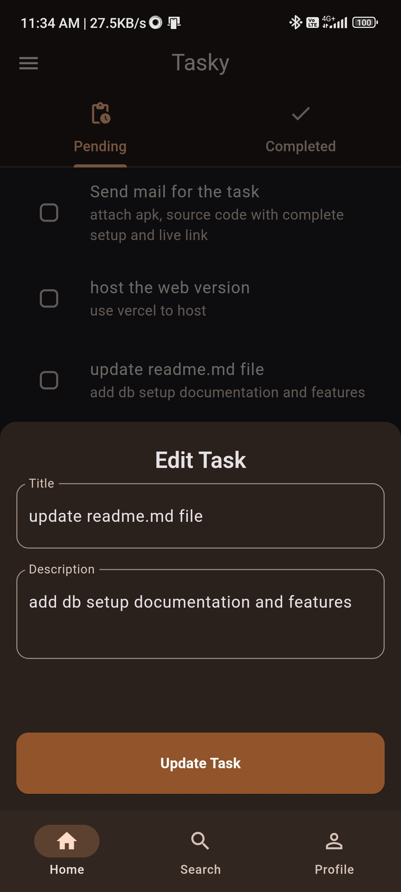
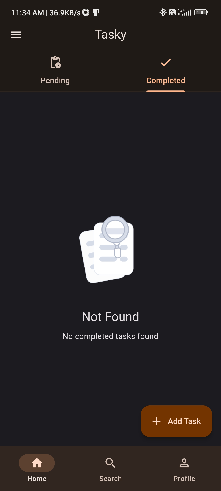
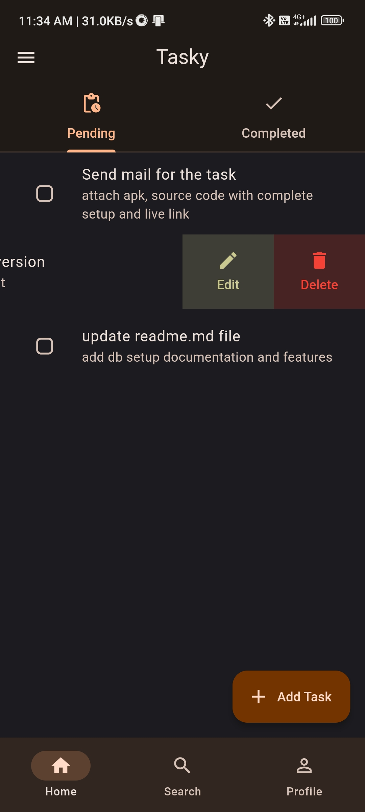
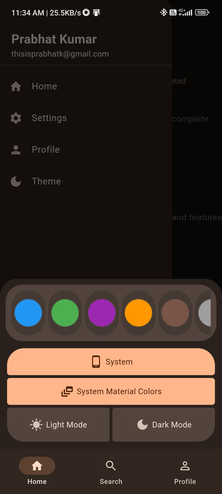

# Tasky - A Task manager app

A task manager app built using flutter, firebase and hive localdb

## Features
- Stores data in firebase when connected to internet, else store data in hive local db.
- Keeps on syncing when the internet connection changes
- Material Dynamic color
- Completely customizable theme changer
- Nested Routing using goRouter
- Authentication
- Proper error handling
- Clean architecture
- Bloc pattern

## Project setup for db
### Create a firebase project in `console.firebase.google.com` 
    - enable `cloud firestore`
    - enable `enable firebase auth` with email and password

### Project setup
These files are ignored in root .gitignore so add these files from firebase setup to make this project work
```.gitignore
/android/app/google-services.json
/ios/Runner/GoogleService-Info.plist
/ios/firebase_app_id_file.json
/lib/core/config/firebase_options.dart
```
1. 1st one is `google-services.json` inside `android/app/`, android setup for firebase
2. `GoogleService-Info.plist` file inside `/ios/Runner/` , ios setup for firebase
3. `firebase_app_id_file.json` inside `/ios/` , ios setup for firebase
4. `firebase_options.dart` inside `/lib/core/config/` , this is flutter setup

## ScreenShots






## Project Structure
```
lib
├───core
│   ├───constants
│   ├───config
│   └───utils
├───data
│   ├───models
│   └───repositories
│       ├───local
│       │   ├───config_repo
│       │   └───task_repo
│       ├───remote
│       │   ├───auth_repository
│       │   ├───user_repository
│       │   └───task_repository
│       └───interfaces
├───domain
│   ├───bloc
│   │   ├───auth_bloc
│   │   ├───config_bloc
│   │   └───task_bloc
│   └───exceptions
└───presentation
    ├───screens
    │   ├───authentication
    │   │   └───components
    │   ├───search
    │   ├───homescreen
    │   │   └───components
    │   ├───onboarding
    │   ├───add_edit_task
    │   ├───profile
    │   ├───settings
    │   │   └───components
    │   └───main_page
    └───widgets
```